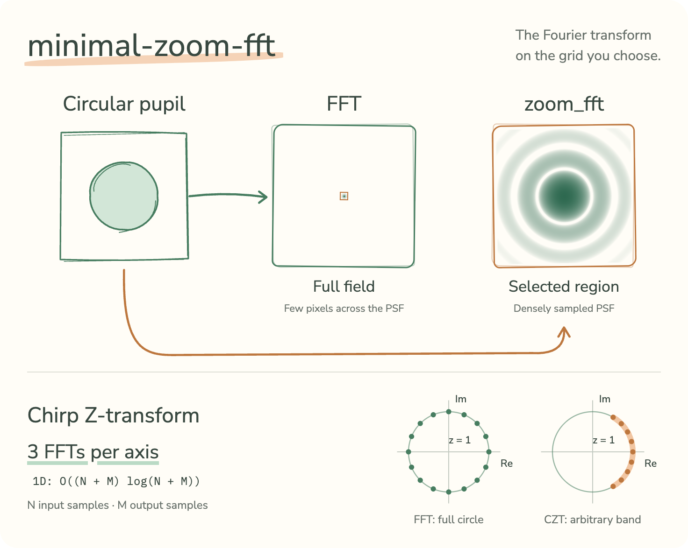

# minimal-zoom-fft

<picture>
  <source media="(prefers-color-scheme: dark)" srcset="docs/assets/overview-dark.png">
  
</picture>

The Fourier transform of a signal on any frequency band, at any sampling, in PyTorch: a zoomed FFT, computed by the chirp Z-transform.

`torch.fft.fft` gives the spectrum at `N` equispaced frequencies over the whole circle. Often you want a narrow band, sampled more finely, with `M ≠ N` points: the PSF of a pupil, Fourier ptychography, diffraction onto a rescaled grid. Bluestein's algorithm does that with three FFTs, in `O((N+M) log(N+M))`, on any device, with autograd.

## Install

```bash
pip install minimal-zoom-fft
pip install git+https://github.com/jon-dong/minimal-zoom-fft     # the development version
```

Python ≥ 3.10, PyTorch ≥ 2.0.

## Quick start

```python
import torch
from minimal_zoom_fft import zoom_fft, zoom_ifft, zoom_freq, czt

x = torch.randn(256, dtype=torch.complex64)

# The band [-0.2, 0.2] rad/sample, sampled at 1024 points.
X = zoom_fft(x, n_out=1024, k_start=-0.2, k_end=0.2)
w = zoom_freq(1024, -0.2, 0.2)               # the 1024 frequencies

# The adjoint; on a full band, the inverse.
x_back = zoom_ifft(zoom_fft(x), n_out=256)   # x again, to round-off

# Images: the last two axes are transformed, the batch axis is untouched.
pupil = torch.randn(8, 64, 64, dtype=torch.complex64)
psf = zoom_fft(pupil, n_out=(256, 256), k_start=-0.5, k_end=0.5,
               dim=(-2, -1), center=True)

# The raw chirp Z-transform.
X = czt(x, n_out=100, w_phase=-0.01, a_phase=0.3)
```

## API

Along one axis with `N` input and `M` output samples:

| Function | Computes |
|---|---|
| `czt(x, n_out, w_phase, a_phase, dim)` | `X[k] = Σₙ x[n] e^{-i a n} e^{i w n k}`, `k = 0..M-1` |
| `zoom_fft(x, n_out, k_start, k_end, dim, norm, center, include_end)` | `X[m] = Σₙ x[n] e^{-i ωₘ (n - c)}` |
| `zoom_ifft(X, n_out, k_start, k_end, dim, norm, center, include_end)` | `x[n] = Σₘ X[m] e^{+i ωₘ (n - c)}` |
| `zoom_freq(n, k_start, k_end, include_end)` | the band samples `ωₘ = k_start + step · m` |

`ωₘ` samples `[k_start, k_end]` in radians per sample; `c` is the origin index set by `center`. Every function acts on the last axis by default (`dim` takes an int or a tuple, `dim=(-2, -1)` for images), leaves the other axes alone, accepts a scalar or one value per axis for `n_out`, `k_start`, `k_end` and `center`, keeps the input's precision, runs on CPU, CUDA or MPS and is differentiable.

`czt_plain` is the readable twin of `czt`: Bluestein's algorithm one step per line, first in [`core.py`](src/minimal_zoom_fft/core.py), pinned to `czt` by the tests. `czt` only differs in where the phases are cast to the working precision, in skipping trivial factors and in padding the convolution to a power of two.

## Conventions

- The defaults reproduce `torch.fft` to round-off: `zoom_fft(x)` is `fft(x, norm="ortho")`, `zoom_ifft` its inverse, `czt(x)` the unnormalised DFT.
- The band is sampled like FFT bins, `step = (k_end - k_start) / M` with the right end excluded; `include_end=True` puts the last sample on `k_end`. The `fftshift`-ed spectrum is the full band starting at `k_start = -2π (N // 2) / N`.
- Normalisation as in `torch.fft` (`"backward"`, `"forward"`, `"ortho"`). On any band, `zoom_ifft` is the adjoint of `zoom_fft` under mirrored norms; on a full band, with the same norm, it is also the inverse.
- `center=False` puts the origin at sample 0, like `torch.fft`; `True` at `N // 2`, the `fftshift` convention; a float puts it anywhere, `(N - 1) / 2` being the geometric centre of the grid. The correction is a phase ramp, exact on any band. In `zoom_ifft`, `center` refers to the output grid.
- The chirps are evaluated in float64, reduced modulo `2π`, then cast, so a float32 transform of thousands of samples stays at float32 round-off.

## Relation to other implementations

`scipy.signal.czt` and `zoom_fft` run the same algorithm on a general spiral; this version keeps to the unit circle and is N-D, batched, GPU-capable and differentiable. The code comes from [psf_generator](https://github.com/Biomedical-Imaging-Group/psf_generator) and the `ciel` library at EPFL: `ciel`'s `custom_fft2(x, shape_out, k_start, k_end, norm, fftshift_input, include_end)` is `zoom_fft(x, shape_out, k_start, k_end, dim=(-2, -1), norm, center, include_end)`; `psf_generator`'s `custom_ifft2` is `zoom_fft` on the negated band, with the norm mirrored and `center=(N - 1) / 2` (checked on bands symmetric about zero).

## Tutorials

Three notebooks in [`notebooks/`](notebooks/), after `pip install -e ".[notebooks]"`:

1. [Tutorial](notebooks/01_tutorial.ipynb): the Airy disk a plain FFT undersamples, and what zero-padding costs.
2. [Details](notebooks/02_details.ipynb): every convention above, checked against brute force.
3. [Benchmark](notebooks/03_benchmark.ipynb): speed against padded FFTs and SciPy, precision, memory.

## Tests

```bash
pip install -e ".[test]"
pytest
```

Every convention above is pinned against explicit float64 sums and against `torch.fft`.

## Authors

- [Jonathan Dong](https://github.com/jon-dong) (EPFL)

## Reviewers

## License

MIT

## Manifest

- Purpose: the Fourier transform of a signal on any frequency band, at any sampling, in PyTorch: a zoomed FFT, computed by the chirp Z-transform.
- Dependencies: `torch`.
- Size: about 350 lines of implementation in one module, 5 public functions; about 690 lines of tests; 3 tutorial notebooks.
- Origin: the `psf_generator` library and the `ciel` computational-imaging library, EPFL; Bluestein's chirp Z-transform. Used by `minimal-linop`'s `fft` extra.
- Provenance: written with Claude (Anthropic) from a brief; read and checked in full by Jonathan Dong.
- Version: 0.1.0, MIT.
